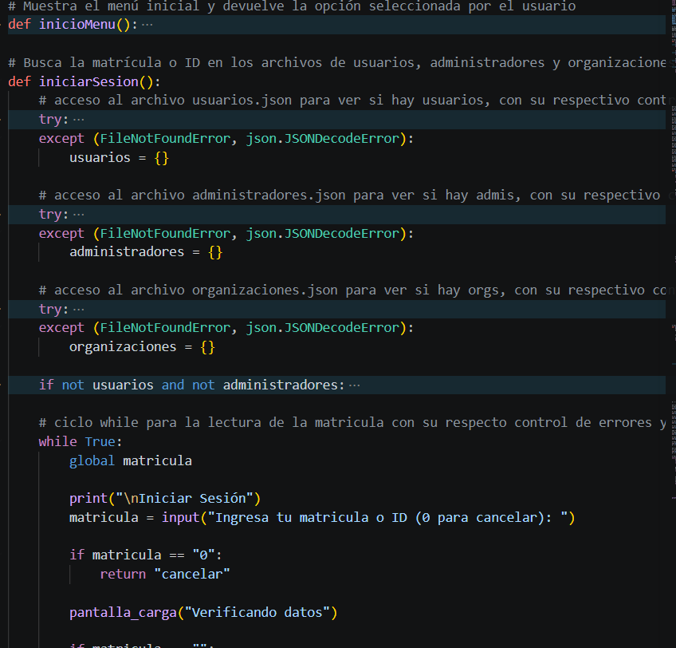
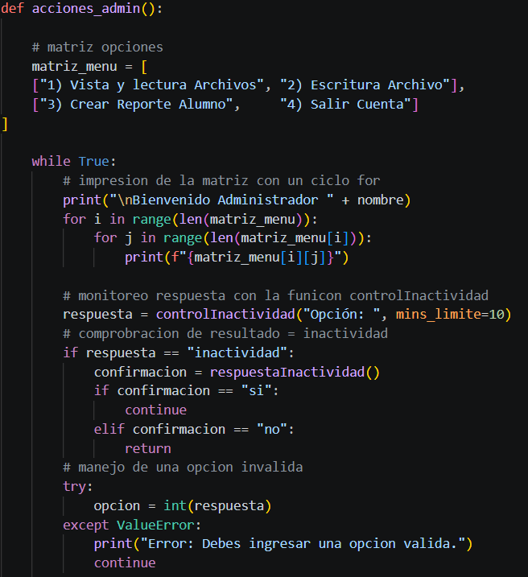
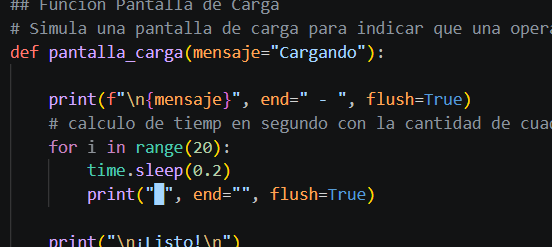
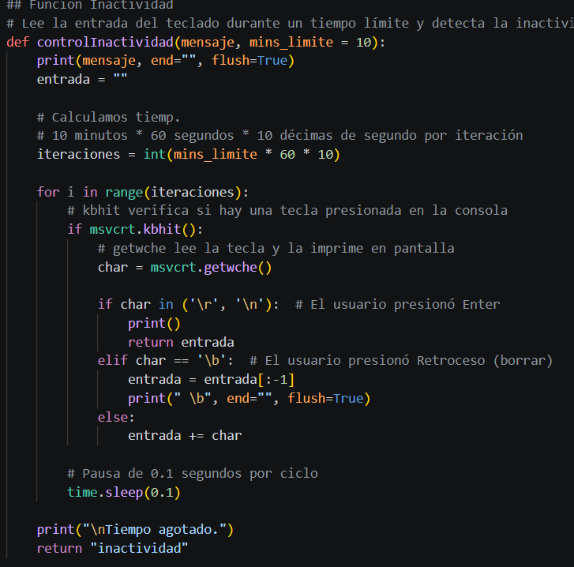
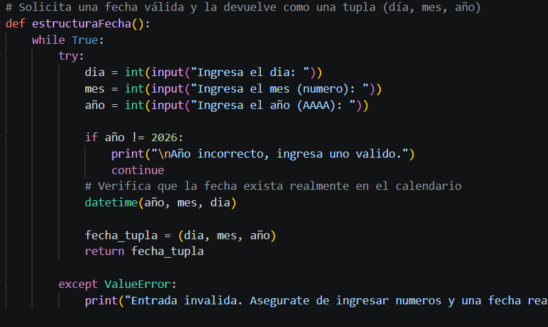
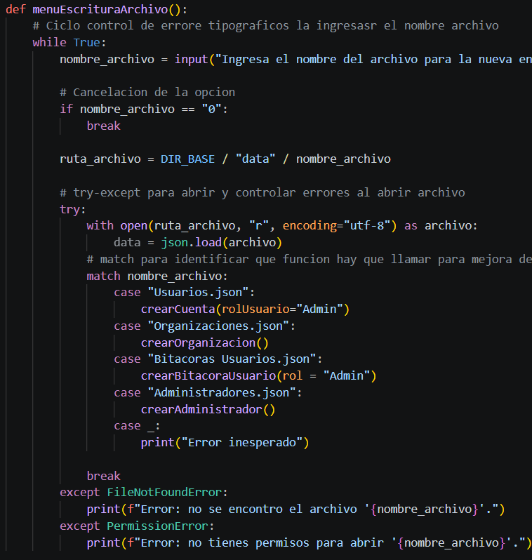
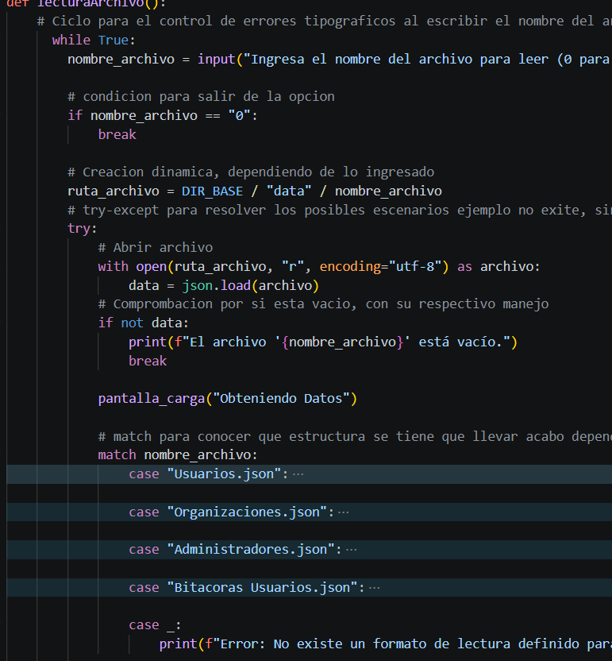
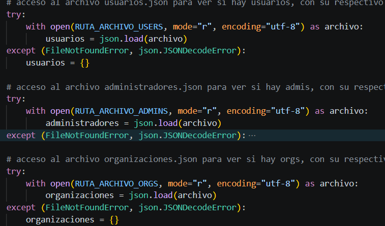
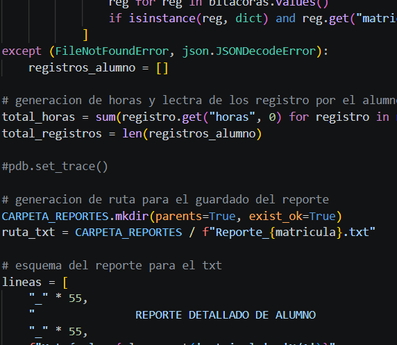
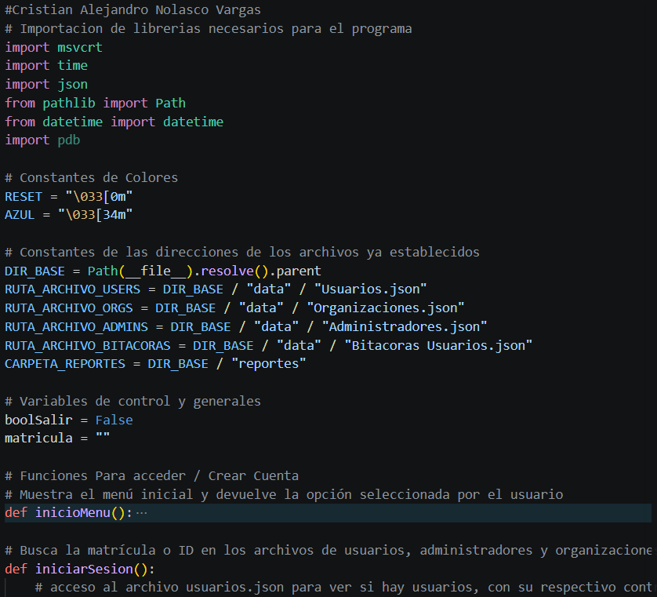

# Documento de Diseño Lógico
## Sistema de Gestión de Servicio Social — Universidad Tecmilenio

Autor: Cristian Alejandro Nolasco Vargas

---

## 1. Análisis Organizacional

**Institución:** Universidad Tecmilenio.

**Área de impacto operativo:** Coordinación de Servicio Social y Vinculación Estudiantil.

**Necesidad:** Esta área es la encargada de vincular a los estudiantes con las organizaciones receptoras y de supervisar tanto el avance del estudiante como el cumplimiento de las organizaciones. El departamento requiere una gestión más ordenada para compartir información clara de cada organización y para mantener un seguimiento correcto del historial de cada estudiante.

---

## 2. Definición del Problema

La falta de información accesible y rápida al iniciar el servicio social genera dudas que pueden ser determinantes para una buena estancia. Contar con información clara y precisa desde el inicio permite al alumno tomar una mejor decisión al elegir organización.

Además, el seguimiento del Servicio Social depende actualmente de un proceso manual basado en formatos impresos, firmas físicas y entrega de reportes en papel. Esto genera puntos críticos:

- Pérdida o deterioro de comprobantes de evidencia.
- Inconsistencia en el conteo de horas acumuladas por alumno.
- Imposibilidad de consultar en tiempo real el catálogo de organizaciones aliadas y su información de contacto.

Para atender esto se desarrolló un sistema de gestión de servicio social en Python que centraliza el catálogo de organizaciones socio-formadoras, permite al alumno inscribirse validando su existencia en dicho catálogo, y administra una bitácora digital de horas trabajadas con cálculo automático del acumulado frente a la meta institucional.

---

## 3. Reglas de Negocio

1. La matrícula de un alumno debe tener exactamente 10 caracteres y ser única en el sistema.
2. El correo de registro debe pertenecer al dominio institucional `@tecmilenio.mx`.
3. Al autorregistrarse, el rol capturado solo puede ser "Alumno" u "Organización"; las cuentas de Organización y Administrador con acceso operativo se dan de alta por soporte técnico o por un administrador ya existente.
4. Un alumno solo puede tener asignada una organización de servicio social a la vez (campo único "Servicio Social" en su expediente).
5. La meta institucional de horas de servicio social es de 480 horas.
6. Cada registro de bitácora debe reportar entre 1 y 8 horas por día.
7. El sistema advierte al usuario que solo debe existir un registro de bitácora por día, aunque la restricción actual es informativa y no bloquea duplicados a nivel de datos (ver Evidencia de Depuración, hallazgo 2).
8. Toda fecha capturada en el sistema debe corresponder al año 2026 y ser una fecha calendario válida.
9. Las sesiones de Alumno y Administrador se cierran automáticamente tras 10 minutos de inactividad, con confirmación de continuidad antes de expulsar al usuario.
10. El total de horas acumuladas de un alumno se recalcula en tiempo real a partir de la suma de todos sus registros de bitácora, sin almacenarse como valor fijo.

---

## 4. Arquitectura de la Solución

**Tipo de aplicación:** Aplicación de consola desarrollada en Python, de arquitectura monolítica y procedural, con control de funciones por rol mediante estructuras `match-case`.

**Persistencia de datos:** Basada en archivos planos en formato JSON, sin motor de base de datos. Se manejan cuatro repositorios independientes:

| Archivo | Contenido |
|---|---|
| `Usuarios.json` | Expedientes de alumnos: matrícula, nombre, carrera, correo, rol, organización asignada |
| `Organizaciones.json` | Catálogo de organizaciones socio-formadoras: ID/RFC, nombre, sector, correo, descripción, página web |
| `Administradores.json` | Cuentas administrativas: ID, nombre, departamento, correo |
| `Bitacoras Usuarios.json` | Registros diarios de actividades: matrícula, fecha, horas, descripción |

El único archivo con extensión `.txt` que produce el sistema es el reporte individual exportable por alumno; toda la persistencia operativa se maneja en formato JSON.

**Módulo de control de sesión:** Lectura de teclado en tiempo real para detectar inactividad y cerrar sesión automáticamente, evitando cuentas abiertas sin supervisión.

**Alcance técnico:** Ejecución local, sin capa de red ni API expuesta. Es una solución adecuada para el volumen y el contexto de un piloto departamental, con la limitación de que no soporta acceso concurrente de múltiples usuarios sobre el mismo archivo ni control transaccional de escritura.

---

## 5. Justificación de los 10 Requerimientos

**R1. Identificación de Usuario.** El sistema solicita al usuario su matrícula o ID al iniciar el programa (`iniciarSesion()`), y a partir de ese identificador único recupera su nombre desde el expediente correspondiente para usarlo en el resto de la sesión.

*Evidencia:*



**R2. Bienvenida Dinámica.** Cada menú de rol construye su encabezado de forma dinámica incorporando el nombre recuperado del expediente, mediante f-strings y concatenación de cadenas (`f"\nBienvenido Alumno {nombre}"`, `"Bienvenido Administrador " + nombre`).

*Evidencia:*



**R3. Pantalla de Carga.** La función `pantalla_carga()` genera una pausa interactiva de 4 segundos (20 iteraciones de 0.2 segundos), imprimiendo progresivamente un indicador visual (`█`) junto con un mensaje dinámico antes de continuar al siguiente menú.

*Evidencia:*



**R4. Menú como Matriz.** Los menús principales (inicio, alumno, administrador) están representados como matrices de dos dimensiones y se recorren con ciclos `for` anidados para su impresión, dentro de un ciclo `while` que controla la selección de opciones sobre los archivos de datos.

*Evidencia:*


**R5. Control de Inactividad del Usuario.** La función `controlInactividad()` usa un ciclo `for` que itera durante el tiempo límite configurado (10 minutos en los menús de Alumno y Administrador) verificando entrada de teclado en cada ciclo. Al agotarse el tiempo, `respuestaInactividad()` exige al usuario escribir exactamente `"si"` para continuar o `"no"` para regresar a la pantalla de inicio.

*Evidencia:*



**R6. Captura de Fecha Estructurada.** La función `estructuraFecha()` solicita día, mes y año por separado, valida que la fecha exista en el calendario con `datetime()`, y devuelve una tupla `(dia, mes, anio)`. Esta tupla se integra automáticamente en cada creación o modificación de expediente, organización, administrador y registro de bitácora.

*Evidencia:*



**R7. Persistencia de Datos.** El sistema mantiene persistencia real en cuatro archivos JSON (`Usuarios.json`, `Organizaciones.json`, `Administradores.json`, `Bitacoras Usuarios.json`), creados previamente en la carpeta `/data`. La opción de lectura del menú administrador (`vistaArchivos()` + `lecturaArchivo()`) lista los archivos disponibles y despliega su contenido estructurado según el tipo de dato al ingresar el nombre exacto del archivo. La opción de escritura (`menuEscrituraArchivo()`) dirige hacia la función correspondiente para crear y anexar nuevos registros de forma permanente en el archivo elegido.

*Evidencia:*




**R8. Control de Excepciones del Sistema.** Prácticamente todas las operaciones de lectura y escritura de archivos están envueltas en bloques `try-except`, capturando `FileNotFoundError`, `json.JSONDecodeError`, `PermissionError` y `OSError`. También se controla `ValueError` en la captura de opciones numéricas y de fechas, evitando que un dato mal escrito detenga la ejecución del programa.

*Evidencia:*



**R9. Depuración Técnica (Debugging).** Se realizó una sesión de depuración con el módulo `pdb` sobre el flujo de servicio social y sobre el registro de bitácora, identificando dos fallas de lógica de control no evidentes en una lectura superficial del código. El detalle completo, con comandos ejecutados, salida obtenida y corrección propuesta para cada hallazgo, se documenta en la sección **Evidencia de Depuración**.

*Evidencia:*



**R10. Comentarios de Calidad.** El código fuente incluye comentarios descriptivos por función explicando su propósito, además de comentarios en línea sobre bloques de validación, estructuras de control y manejo de excepciones, facilitando su mantenimiento por terceros.

*Evidencia:*


---

## 6. Evidencia de Depuración

Para cumplir el requerimiento de depuración técnica se aisló la lógica de dos funciones críticas del sistema en scripts de prueba independientes, y se ejecutaron con el módulo estándar `pdb` para inspeccionar el estado del programa en el punto exacto de la falla.

### Hallazgo 1: excepción no controlada en `servicioSocial()` con matrícula inexistente

**Código afectado:** `alumno = usuarios.get(matricula)` seguido de `if not alumno.get("Servicio Social"):`

**Procedimiento:** Se ejecutó la lógica de la función con una matrícula que no existe en `Usuarios.json`, usando `pdb.post_mortem()` para capturar el estado tras el fallo.

**Resultado observado en pdb:**
```
=== EXCEPCIÓN CAPTURADA, ENTRANDO A PDB POST-MORTEM ===
> servicioSocial_debug()
-> if not alumno.get("Servicio Social"):
(Pdb) p matricula
'NOEXISTE01'
(Pdb) p alumno
None
(Pdb) where
  <module>()
-> servicioSocial_debug()
> servicioSocial_debug()
-> if not alumno.get("Servicio Social"):
```

**Causa raíz:** `usuarios.get(matricula)` devuelve `None` cuando la matrícula no está registrada, y el código llama de inmediato `.get()` sobre ese resultado sin validar antes que `alumno` no sea `None`. Esto produce un `AttributeError: 'NoneType' object has no attribute 'get'` que no está cubierto por ningún `try-except`, ya que el bloque de manejo de errores solo envuelve la apertura del archivo, no la lógica posterior.

**Corrección propuesta:**
```python
alumno = usuarios.get(matricula)
if alumno is None:
    print(f"Error: la matrícula '{matricula}' no tiene expediente registrado.")
    return
```

### Hallazgo 2: sobrescritura silenciosa de horas al registrar dos veces el mismo día

**Código afectado:** `bitacoras[f"{matricula} - {fechaTupla}"] = {...}` dentro de `crearBitacoraUsuario()`

**Procedimiento:** Se colocaron dos puntos de verificación (`pdb.set_trace()`) antes y después de simular un segundo registro de bitácora para la misma matrícula y la misma fecha, inspeccionando el diccionario `bitacoras` en cada punto.

**Resultado observado en pdb:**
```
(Pdb) p bitacoras   # antes del segundo registro
{'AL12345678 - (5, 3, 2026)': {'horas': 4, 'descripcion': 'Actividad A', ...}}
(Pdb) p len(bitacoras)
1
--- se ejecuta el segundo registro con 6 horas ---
(Pdb) p bitacoras   # después del segundo registro
{'AL12345678 - (5, 3, 2026)': {'horas': 6, 'descripcion': 'Actividad B', ...}}
(Pdb) p len(bitacoras)
1
```

**Causa raíz:** La clave del diccionario se construye concatenando matrícula y fecha (`f"{matricula} - {fechaTupla}"`). Si el alumno registra dos veces el mismo día, la segunda escritura usa la misma clave y sobrescribe por completo el registro anterior. El programa solo imprime una advertencia de texto ("Advertencia solo se puede añadir un registro por día"), pero no valida ni impide la operación, por lo que las primeras 4 horas capturadas se pierden sin ningún aviso de que hubo una sobrescritura.

**Corrección propuesta:** antes de guardar, verificar si la clave ya existe y, si es así, bloquear la operación o sumar las horas al registro existente en lugar de reemplazarlo:
```python
clave = f"{matricula} - {fechaTupla}"
if clave in bitacoras:
    print("Ya existe un registro para esta fecha. No se puede duplicar.")
    continue
```


---

## 7. Conclusión

El sistema resuelve el núcleo del problema planteado: centraliza la información de organizaciones socio-formadoras, ordena el expediente y el historial de cada alumno, y automatiza el cálculo de horas frente a la meta institucional, eliminando la dependencia de formatos impresos para el seguimiento diario. La sesión de depuración documentada en la sección anterior deja además dos correcciones puntuales y concretas como siguiente paso inmediato antes de un despliegue más amplio.